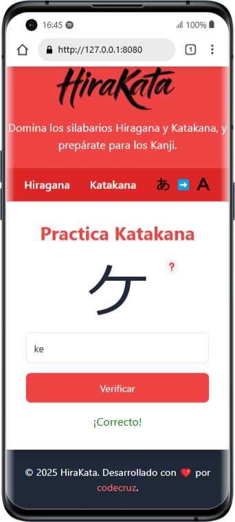
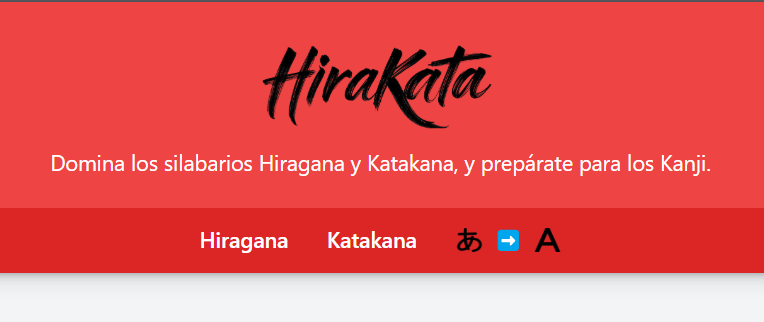

## HiraKata 

  

This application is currently a **Work in Progress (WIP)**. At the moment, it includes the following features:

## **Hiragana and Katakana charts** 
A complete reference table for all Hiragana and Katakana characters, including basic characters, dakuten (゛), handakuten (゜), and combinations (e.g., きゃ, きゅ, きょ).

  

 

## **Random Hiragana and Katakana Quizzes**
A simple quiz mode where you can test your knowledge of Hiragana and Katakana characters. The quiz randomly selects characters from the Hiragana / Katakana table, including variations, to help you practice recognition and recall.

  
  

 
## **💡New Feature: Reverse Mode (Kana to Romaji)** 
Now you can practice writing Japanese characters from their romanization! Switch to "Reverse Mode" and challenge yourself to recall the correct Hiragana or Katakana character based on its Romaji equivalent. Perfect for mastering both recognition and writing skills!

  

### Planned Features:
- **Kanji Learning**: Once the Hiragana and Katakana features are fully developed, the app will expand to include Kanji characters, starting with the most basic ones and gradually introducing more complex characters.
- **Additional Activities**: Beyond quizzes, the app will incorporate various learning methods such as flashcards, writing practice, and spaced repetition to enhance your learning experience.
- **Gamification**: Earn points, unlock achievements, and track your progress as you master each syllabary and Kanji set.

### Why WIP?
This app is being developed iteratively to ensure a high-quality learning experience. Your feedback is invaluable! 

If you encounter any problems, have suggestions or bugs for improvements, please don’t hesitate to open an issue or contact me. I really appreciate your feedback! 

&nbsp;  

Stay tuned for updates! 🚀
